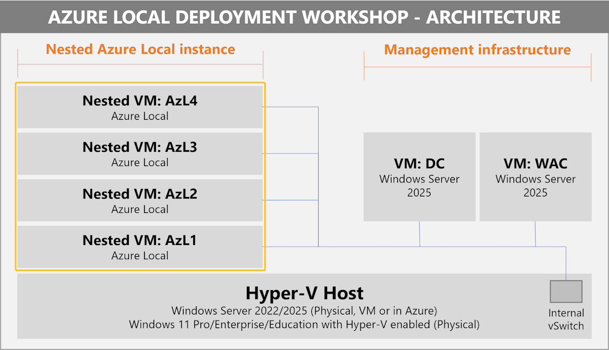

# Azure Local Deployment Workshop

## Welcome

Written by me, Matt McSpirit, Microsoft Azure MVP and Engineering Technologist at Dell Technologies, the goal of the Azure Local Deployment Workshop is simple; to **help you grow your knowledge, skills and experience around preparing for, and subsequently deploying Azure Local**.

## About the workshop

Since the transition from Azure Stack HCI 22H2, to 23H2, and the evolution to Azure Local, the overall solution has grown in complexity - firewall and outbound connectvity, identity integration, Azure permissions, network configuration and more, and whilst the documentation is improving, the availability of a fast-to-deploy sandbox environment with accompanying documentation, that can be used to accurately mimic a real-world physical deployment has been sorely lacking. That's where this workshop comes in.

## How is this different to other environments and jumpstarts?

There are a number of different options out there to help build your knowledge. This includes [MSLab](https://github.com/microsoft/MSLab), written by my peer Jaromir Kaspar, which provides a plethora of options for deploying a variety of different configurations and scenarios around Azure Local and Windows Server.

There's also the [Azure Arc Jumpstart](https://jumpstart.azure.com/azure_jumpstart_hcibox), which provides a complete, automated sandbox for exploring Azure Local capabilities and hybrid cloud integration in a virtual environment.

So, what's so different about the Azure Local Deployment Workshop?

**The Azure Local Deployment Workshop:**

- Can run in nested in Azure **and** can be deployed identically on-premises, either on a physical Windows Server/Client, or inside an existing VM on a virtualization platform of your choice. This saves you money, if you have existing equipment.
- When running in Azure, the resources configured inside the VM, and the VM configurations themselves are **optimized to keep costs lower than alternative solutions**.
- The deployment of the sandbox is **fully automated** - no need to download ISOs, executables, zip files etc - within a few simple PowerShell commands (or through an Azure ARM Template) you'll be ready to practice deployments.
- The automation creates a sandbox to **more closely mimic real world deployments**, for example, when deploying a 4-machine Switchless Dual-Link configuration, should every Azure Local machine be able to communicate with every other machine over a generic switch configuration? NO! This workshop simulates real-world configurations, with isolated network paths and more, to ensure you can experience deployments the right way.

### What's getting deployed?

Take a look at this graphic, which depicts a generic deployment of the sandbox:

As you can see from the graphic, you'll **firstly need a Hyper-V host** - this could be:

- A physical machine that's running Windows 11 or Windows Server. In the case of Windows 11, it just needs to support Hyper-V - not all editions do, so please check!
- A Windows Server 2022/2025 virtual machine on an existing hypervisor that supports nested virtualization
- A Windows Server 2025 virtual machine running in Azure

Don't worry about the details for now, I'll provide more details later.

Once you have a host, the automation takes care of spinning up a custom sandbox environment, comprising of **1-4 nested Azure Local machines** (meaning, you can test all of the different architecture types across single-node, through non-and-fully-converged network patterns, plus switchless configurations), a **Domain Controller**, and optionally, a server running Windows Admin Center. This is pretty much everything you need to test Azure Local, and it'll be ready in about an hour.

### What's NOT getting deployed?

The goal of this workshop is to help you learn how to deploy the Azure Local instance, configuring your machines, networks and more along the way. So, you're not getting a completed deployment once the automation has finished! What would you learn from that? if that's your goal, to have a completed instance once the automation has finished, then the [Azure Arc Jumpstart](https://jumpstart.azure.com/azure_jumpstart_hcibox) is a better fit.

If you want to experience **actual deployments of Azure Local instances**, read on....

## Is this workshop right for me?

The goal of this workshop is to immerse you in the deployment experience for Azure Local. As part of the workshop, you'll be exposed to a number of more technically complex features and functionality across a number of the key areas within the overall Azure Local deployment. This will involve hands-on time with both GUI and Console/PowerShell-based interfaces. With that in mind, this workshop is aimed at, but by no means limited to:

- IT Professionals / Enthusiasts / Evangelists
- Operations Teams
- System / Infrastucture Administrators
- Technical Pre-Sales Roles
- System Integrators / Deployment Engineers

With that said, one goal of the workshop is to ensure that the more complex elements are simplified for broader audiences, so even if your role and experience doesn't fit with those previously mentioned, give the workshop a try, and provide us feedback on how we can make it better for you!

### How much time do I need

Well, that depends :-) - The workshop is incredibly flexible, and you can start and stop to meet your needs, however, an end-to-end deployment of an Azure Local environment from start to finish, is likely to take a few hours to half a day, depending on the number of nodes you're planning to deploy within your sandbox environment.

## Getting Started

If you're ready to start your learning, head on over to the first module, to familiarize yourself with the hardware/software requirements for the workshop, and learn more about the tooling you'll use to deploy the solutions.

**Head over to the [Azure Local Deployment Workshop | Infrastructure Prerequisites](/modules/module_0/1_infra_prerequisites.md)**

## Raising issues

If you notice something is wrong with the workshop, such as a step isn't working, or something just doesn't make sense - help us to make this guide better!  [Raise an issue in GitHub](https://github.com/DellGEOS/AzureLocalDeploymentWorkshop/issues), and we'll be sure to fix this as quickly as possible!

## Contributions & Legal

### Contributing

This project welcomes contributions and suggestions - if you have edits, or wish to provide feedback, please feel free to do so - we'll incorporate any changes that can improve the overall experience for all users! Make sure you read the [contributing guidance](.github/CONTRIBUTING.md) before submitting!

### Legal Notices

You are granted a license to the content in this repository under the [Apache License 2.0](http://www.apache.org/licenses/LICENSE-2.0), see the [LICENSE](LICENSE) file.

Dell Technologies, Dell and other trademarks referenced in the workshop guidance are trademarks of Dell Inc. or its subsidiaries.

Microsoft, Windows, Microsoft Azure and/or other Microsoft products and services referenced in the workshop guidance may be either trademarks or registered trademarks of Microsoft in the United States and/or other countries.

The licenses for this project do not grant you rights to use any Microsoft or Dell Inc. names, logos, or trademarks. The respective trademark guidelines are available online for [Dell Inc.](https://www.dell.com/learn/us/en/uscorp1/terms-conditions/trademarks-us) and [Microsoft](http://go.microsoft.com/fwlink/?LinkID=254653).

Dell Technologies Privacy information can be found at <https://www.dell.com/en-us/lp/privacy-center>.

Microsoft Privacy information can be found at <https://privacy.microsoft.com/en-us/>

Dell Technologies, Microsoft and any contributors reserve all other rights, whether under their respective copyrights, patents, or trademarks, whether by implication, estoppel or otherwise.
